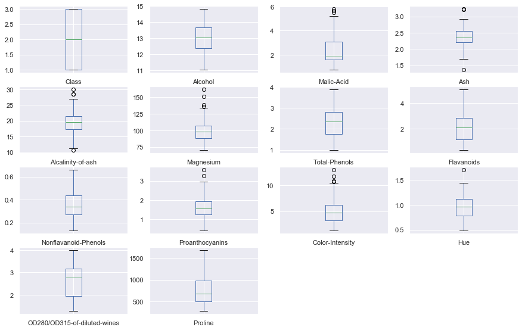
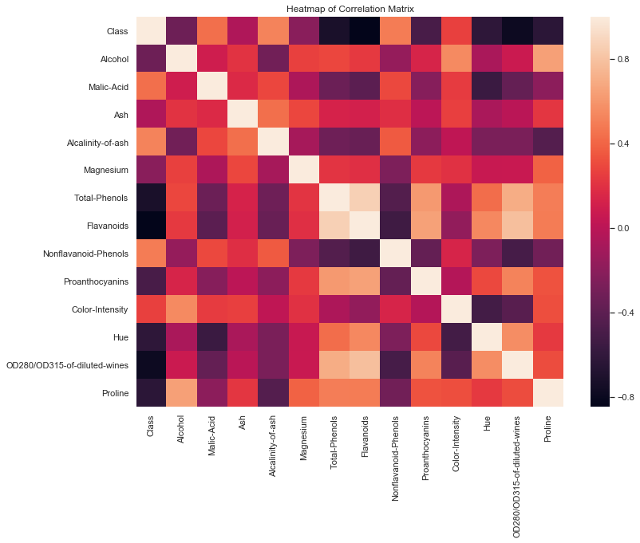

Updates in progress...
# Wine exploration

### Introduction 
For my practice project I chose this project to aid me in better understanding the various steps involved in a predictive analytics project. This project is about using chemical analysis to determine the origin of wines.

### Data collection
The data used in this analysis was gotten from the online machine learing data repository of the Center for Machine Learning and Intelligent Systems at the University of California, it was available in a csv file format.
The attributes of the datasets are listed below: 

- Alcohol 
- Malic acid 
- Ash 
- Alcalinity of ash 
- Magnesium 
- Total phenols 
- Flavanoids 
- Nonflavanoid phenols 
- Proanthocyanins 
- Color intensity 
- Hue 
- OD280/OD315 of diluted wines 
- Proline 

The dataset contained 178 wine chemical anaylsis of three types of wines.

### Preprocessing
From my observations, the dataset had no missing values, and there are outliers to investigate.

### Exploratory Data Analysis
In gaining more understanding about the dataset it was important to carry out exploratory data analysis on the data,
this was done by using univariate plots to better understand individual attributes, and multivariate plots to better understand the relationships between attributes.

### Modeling

### Conclusion
